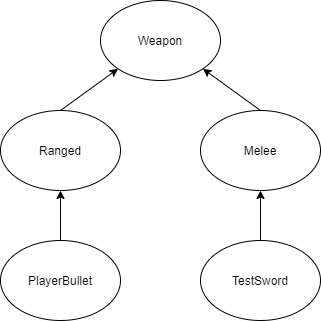

# hades-like
Some kind of roguelite Unity project

## How to setup
1. Download Unity Hub and the correct version of the Unity editor (currently 2020.1.14f.1, THIS MIGHT BE CHANGED LATER)
2. Open ***`hades-like-project`*** with the unity editor
3. Start working

## Git workflow
1. Create a branch for a new feature or for personal workspace
2. Create a pull request to merge branch to another one (for example develop)

## Random rooms and rewards
Rooms and rewards are randomized by loading a specified folder inside of the ***`Resources`*** folder. For example, if you want to load a normal room on floor 1 you should load ***`Resources/Rooms/Floor1/NormalRooms`***. Loading rewards is the same but with the ***`Rewards`*** folder.

## Weapons inheritance
Planned inheritance tree

